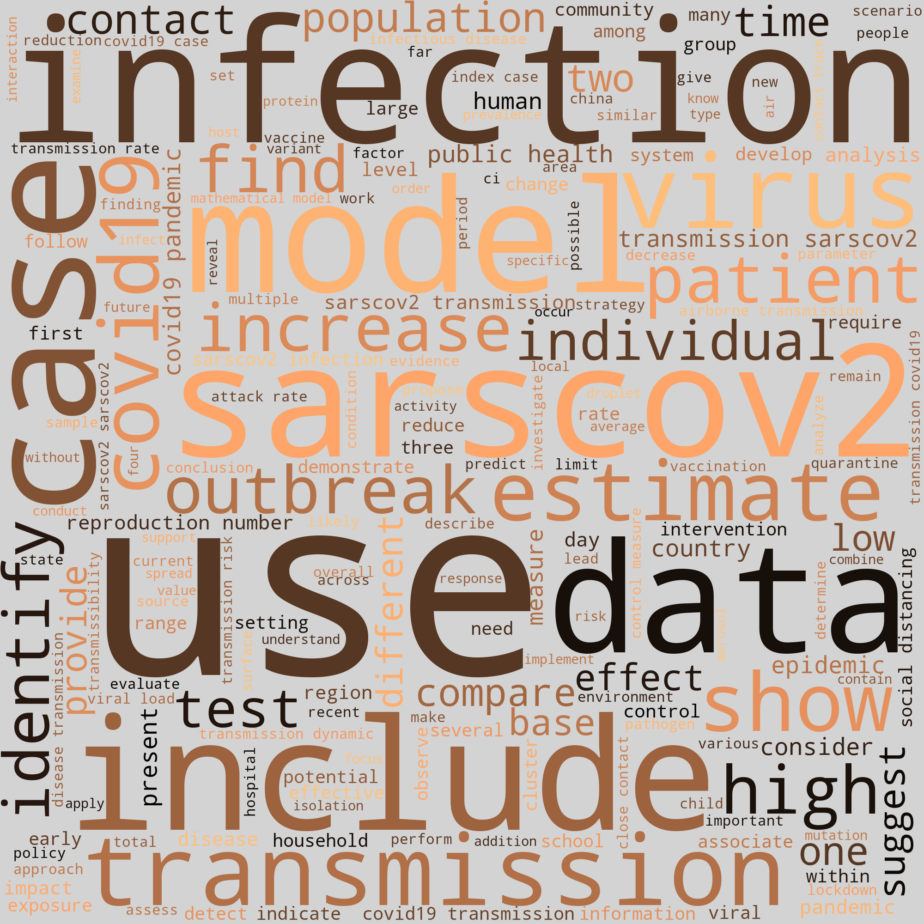
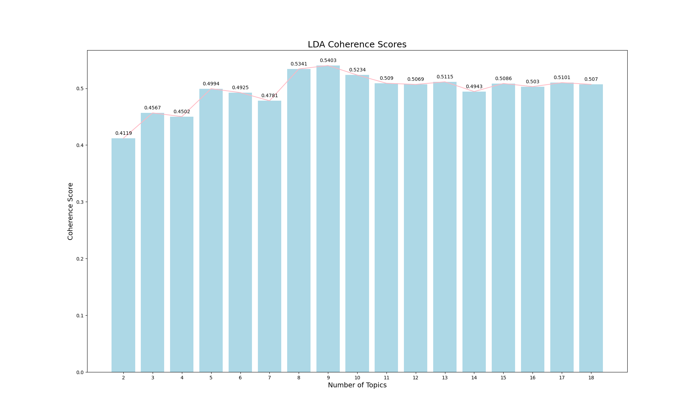

#### Summary

- I configured Apache Airflow and wrote Python scripts (Airflow DAGs) to process and ingest the COVID-19 Open Research Dataset (CORD-19) dataset into Elasticsearch.
- I configured Elasticsearch to store over 300,000 COVID-19 scholarly articles on COVID-19 and other coronaviruses.
- I developed an LDA topic model to group the data into nine topics of COVID-19 transmission using the Gensim Python library.
- I developed a Word2Vec model to learn words associated with different topics of COVID-19 transmission using Gensim.
- I developed a cosine similarity-based recommendation system that recommends scholarly articles on COVID-19 transmission using scikit-learn.

#### Word Cloud

#### Topic Model

#### Coherence Score

